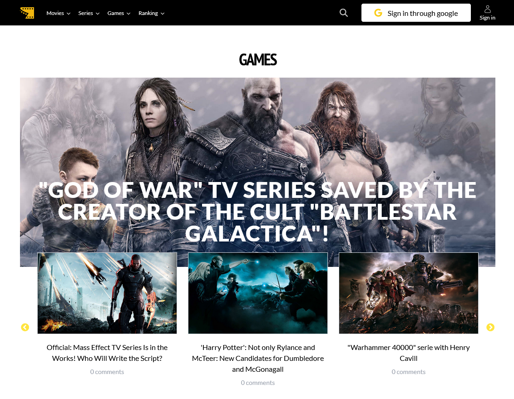
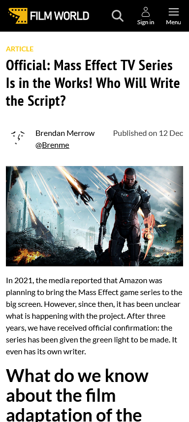

<h1 align="center">🎬 Film World</h1>
<h3 align="center">Your one-stop movie database with custom articles, user authentication, and slick UI.</h3>

  
  
  

---

## 🚀 Overview

<a href="https://pownprojects.site/film-world" style="text-decoration: underline; font-weight: bold;">Film World</a>
 is a full-stack movie catalog and blogging platform built with the MERN stack. Users can explore movies, series and games, write custom articles using Editor.js (admin only), and log in via email, Google, or Facebook.

---

## ✨ Features

- 🔐 **Authentication**
  - Firebase Auth for Email/Password, Google, and Facebook sign-in
  - JWT-based session management

- 📝 **Custom Articles**
  - Rich text editor via **Editor.js**
  - Image/file uploads to **AWS S3**

- 🎞️ **Movie Carousel**
  - Beautiful, responsive sliders with **React Slick**

- 🧭 **Navigation**
  - Smooth routing with **React Router DOM**

- 🎨 **Styling**
  - Fully responsive design with **TailwindCSS**

- ☁️ **Cloud Storage**
  - Images/files hosted securely via **AWS S3**

- 🧠 **Database**
  - MongoDB + Mongoose for storing users, articles, and movies

---

## 🛠️ Tech Stack

| Frontend    | Backend            | Other Services        |
| ----------- | ------------------ | --------------------- |
| React       | Node.js + Express  | Firebase Auth         |
| TailwindCSS | JWT                | AWS S3                |
| React Slick | MongoDB + Mongoose | Editor.js             |
|             |                    | Google/Facebook Login |

---

## 🖼️ Screenshots

    

    

